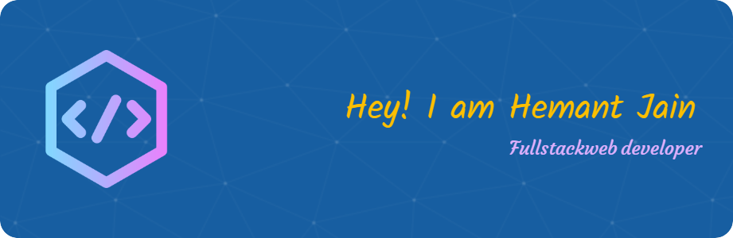

<!--  -->
<!--  -->
<!--  -->

  
<!-- <h1 align="center">𝓘 𝓪𝓶 𝓗𝓮𝓶𝓪𝓷𝓽 𝓙𝓪𝓲𝓷</h1>

  

 -->

  <h2>𝐀𝐛𝐨𝐮𝐭 𝐌𝐞.</h2>

  - 🔭 I’m currently working on **Forest and Climate Change Department, Govt. of Chhattisgarh.**
  
  - 🌱 I’m currently learning **Full Stack Web Development.**
  
  - 💬 Ask me about **Software Development related stuffs**

  <!-- - 👨‍💻 All of my projects are available at (https://jain-hemant.github.io/)

  - 📫 How to reach me **hemantjain.dev@gmail.com** -->

  - 📄 Know about my experiences [Resume](https://resume-builder-test-new.masaischool.com/resume/public?resumeId=66ac86f2403a9ded28d86d1a)

  <!-- - ⚡ Fun fact **...** -->

    <h2>𝐇𝐨𝐰 𝐭𝐨 𝐫𝐞𝐚𝐜𝐡 𝐦𝐞.</h2>
    
    
    

<!--   -->
<!-- Visior and Follower Count -->

    <h3>𝐘𝐨𝐮 𝐚𝐫𝐞 𝐭𝐡𝐞 𝐯𝐢𝐬𝐢𝐭𝐨𝐫 #</h3>
    
    
    

<!-- 

    
    
    

 -->

<h2 align="left"> 📌 𝐓𝐞𝐜𝐡 𝐒𝐭𝐚𝐜𝐤:</h2>

  <h3> 🖥️ FrontEnd: </h3>    
 
 
 
 
 
 
 

 
<h3> 👾 BackEnd: </h3> 
   
   
   
    
   
    
 

   
<h3> ⚓️ Tools: </h3>
    
    
    
   
   
   

 

 
 
 

<!-- End Language And Tools -->

<!-- Trophy -->

 
     

# 📊 𝐆𝐢𝐭𝐇𝐮𝐛 𝐒𝐭𝐚𝐭𝐬:

    

        
    

    

        
    

<!-- Graph1 -->

<!-- Graph2 -->

<a href="https://github.com/jain-hemant">

</a> 

 <!-- Trophy -->
<!-- 

 -->

<!-- 
  
 -->

---
<!-- <h3 style="text-align: center;">Stay Happy, Stay Motivated  </h3>

  
  &nbsp;&nbsp;
  
  &nbsp;&nbsp;
  
  &nbsp;&nbsp;
  
  &nbsp;&nbsp;
  
-->

<!-- Not working -->
<!-- ## 📊  My Github Stats
   
  

    
    
 

  
 
  -->

    <h2> 𝕾𝖔𝖒𝖊 𝕻𝖗𝖔𝖌𝖗𝖆𝖒𝖒𝖎𝖓𝖌 𝕳𝖚𝖒𝖔𝖗 𝖋𝖔𝖗 𝖞𝖔𝖚. </h2>
    

# ✍️ 𝐑𝐚𝐧𝐝𝐨𝐦 𝐃𝐞𝐯 𝐐𝐮𝐨𝐭𝐞

 

  <a href="#top">
    <h2 align="center"> 
      тнαηкѕ ƒσя νιѕιтιηg му ρяσƒιℓє. 
      
    </h2>    
  </a>

    <!-- Curve Line 1 - small -->
    

      
    

  <!-- eat code sleep -->
  
  <!-- Curve Line 2 - Bigger -->
  

    

  <!--  -->

**Hemant Jain**, **Hemant Jain GitHub**, **jain-hemant**, **Software Developer Hemant Jain**, **Open Source Contributor Hemant Jain**, **Python Developer Hemant Jain**, **React Developer Hemant Jain**

<!-- 
 -->
